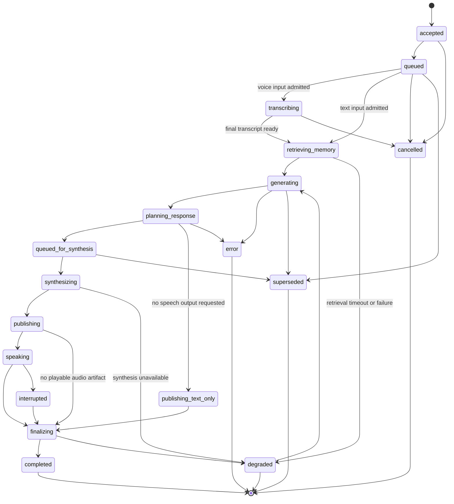

# Turn State Machine And Event Contract

## Purpose

This document defines the concrete backend-owned turn model for NikoF.

It exists to turn the current high-level workflow

`Mic -> STT -> Memory -> LLM -> TTS -> Avatar`

into one implementation contract that can be queued, traced, cancelled, and replayed consistently.

The contract in this document must stay aligned with:

- `docs/ARCHITECTURE.md`
- `docs/BACKEND_ANIMATION_CONTRACT.md`
- the backend-owned ordered `speech.lifecycle` envelope
- the frontend speech and animation consumers

This document is the planning source of truth for the first full conversation orchestrator slice.

## Design Rules

1. One backend turn orchestrator owns the full user-to-assistant lifecycle.
2. Text input and voice input normalize into the same internal turn model.
3. The frontend remains a consumer of canonical backend events, not a second orchestrator.
4. Queue boundaries are explicit so delay, cancellation, and overload behavior are inspectable.
5. Public transport stays provider-agnostic even when internal workers differ.
6. Memory retrieval and memory writes are separate stages with different latency budgets.
7. TTS stays backend-owned and queue-backed.
8. Speech, animation, and emotion outputs all derive from one assistant turn result.

## Current Fit With The Repository

The repository already has part of this contract implemented:

- ordered `speech.lifecycle` delivery with stable `event_id`, `sequence`, and `cursor`
- a backend-owned TTS queue worker
- canonical `assistant.message` and `speech.synthesis` event publication
- frontend speech playback and viseme consumption
- frontend passive emotion and passive mouth layers

The repository does not yet have:

- a single turn coordinator that sequences STT, memory retrieval, LLM generation, TTS, animation intent, and memory writes under one state machine
- a durable turn journal
- an explicit barge-in and supersede policy
- a concrete public event taxonomy for queue, turn, and interruption states
- a dedicated asynchronous memory-write stage

## Turn Identity And Ownership

Every user interaction that can produce an assistant response must create one `turn_id`.

Required identifiers:

- `session_id`: scopes ordered delivery and memory ownership
- `turn_id`: identifies the current user-to-assistant exchange
- `trace_id`: ties logs, queue metrics, provider spans, and published events together
- `character_id`: identifies the active persona, voice profile, and override scope
- `parent_turn_id`: optional reference for retries, follow-ups, or superseded turns

Ownership rules:

- the backend orchestrator owns turn creation, state transitions, and terminal status
- STT, memory, LLM, TTS, and animation services never invent their own turn ids
- the frontend may cache the active turn id but must not author state transitions

## Queue Boundaries

The concrete turn pipeline uses these queue and worker boundaries.

### 1. Ingress Queue

Purpose:

- normalize text or final STT transcript into a `TurnRequest`
- stamp `turn_id` and `trace_id`
- reject malformed or rate-limited input early

Policy:

- small bounded queue
- reject on overload with a canonical degraded event
- never holds audio chunks directly beyond the ingestion stage

### 2. Per-Session Turn Queue

Purpose:

- serialize assistant work per session
- prevent overlapping reasoning and reply publication

Policy:

- max one active executing turn per session
- queued turns may be superseded by newer user input if the session policy allows interruption
- this queue is the authority for `queued`, `started`, `superseded`, and `cancelled`

### 3. STT Chunk Pipeline

Purpose:

- handle microphone audio frames and partial transcription without blocking turn execution

Policy:

- bounded frame buffering
- partial transcripts are non-canonical UI hints until finalized
- only final transcript admission creates or advances a conversational turn

### 4. Memory Retrieval Worker Pool

Purpose:

- build the working-memory package for the LLM

Policy:

- short latency budget
- return best-effort results on timeout
- retrieval failure degrades gracefully and must not block reply generation indefinitely

### 5. LLM Execution Queue

Purpose:

- gate GPU or model-runtime concurrency

Policy:

- bounded concurrency across sessions
- queue wait time is logged
- cancellation must be supported before reply publication where the runtime permits it

### 6. TTS Synthesis Queue

Purpose:

- synthesize final spoken text and timing metadata

Policy:

- backend-owned FIFO queue
- one warm runtime per configured synthesis lane
- synthesis delay must not erase the already-generated assistant text

### 7. Memory Write Queue

Purpose:

- persist the finalized exchange, preference candidates, summaries, and affinity updates

Policy:

- asynchronous and lower priority than reply generation
- idempotent on retry
- may continue after audio publication

### 8. Optional Vision Enrichment Queue

Purpose:

- process sampled camera-derived context outside the voice critical path

Policy:

- sampled, bounded, and optional
- dropped or delayed work must never block the active turn

## Concrete Turn State Machine

One turn moves through the following states.



### State Definitions

- `accepted`: the backend has normalized the request and assigned identifiers.
- `queued`: the turn is waiting for per-session execution ownership.
- `transcribing`: voice input is still being finalized into canonical text.
- `retrieving_memory`: the orchestrator is collecting recent context, profile facts, and relevant prior exchanges.
- `generating`: the LLM is producing the structured assistant result.
- `planning_response`: the raw model result is being normalized into assistant text, emotion, gesture, and synthesis inputs.
- `queued_for_synthesis`: final spoken text is waiting for the TTS worker.
- `synthesizing`: TTS is producing audio and timing metadata.
- `publishing_text_only`: assistant text has been published without speech output.
- `publishing`: canonical events and artifact references are being appended and exposed.
- `speaking`: the frontend is expected to be consuming the published speech artifact and timing.
- `interrupted`: active speech was cut short by user barge-in, session stop, or explicit cancel.
- `finalizing`: post-turn bookkeeping is running, including memory writes.
- `completed`: the turn finished normally.
- `degraded`: the turn finished with a bounded failure in one non-fatal stage.
- `cancelled`: the turn was aborted before a reply should continue.
- `superseded`: a newer turn replaced this one before completion.
- `error`: an unrecoverable backend error ended the turn.

## State Transition Rules

### Admission

- Text input enters `accepted -> queued -> retrieving_memory`.
- Voice input enters `accepted -> queued -> transcribing` and does not advance until the backend has a canonical final transcript.

### Retrieval And Generation

- `retrieving_memory` failure becomes `degraded` only when the assistant can still answer without memory.
- `generating` failure becomes `error` when no assistant reply can be safely published.

### Synthesis

- Assistant text publication must happen before or alongside `queued_for_synthesis`; it must not wait for speech playback to complete.
- TTS failure moves the turn to `degraded` when assistant text is still publishable.

### Finalization

- `finalizing` owns durable writeback, summary refresh, preference extraction, and metrics emission.
- failures in `finalizing` should not retract already-published assistant text or audio.

## Barge-In, Cancellation, And Supersede Policy

The session queue must enforce these rules.

### User Barge-In While Assistant Is Speaking

1. mark the old turn `interrupted`
2. cancel or fade active audio playback if supported
3. clear pending speech overlays and return the avatar to `listen`
4. admit the new user input as a new turn
5. move the old turn through `finalizing -> superseded` or `finalizing -> completed` depending on whether a partial reply should be retained

### New User Input While A Prior Turn Is Queued Or Generating

- session policy may supersede the older turn before synthesis starts
- the superseded turn must emit a canonical terminal event
- queued TTS work for a superseded turn must be dropped before synthesis begins

### Session Stop

- active turn becomes `cancelled`
- queued turns for the session become `cancelled`
- no new synthesis or memory write work should start after the stop boundary unless explicitly configured for cleanup only

## Working-Memory Package

The LLM input stage must assemble a bounded working-memory package rather than sending raw storage rows.

Required slices:

- recent transcript window
- explicit user profile facts
- explicit user likes and dislikes
- inferred preferences with confidence
- relationship or affinity summary for the active character
- unresolved follow-ups or commitments
- ranked semantic recall results with provenance
- optional bounded vision context

The working-memory package is internal. It should be attributable in logs but not exposed directly to the frontend unless intentionally surfaced.

## Structured Assistant Result

The LLM stage should normalize into one structured assistant result before TTS or animation work begins.

Required fields:

- `spoken_text`
- `display_text`
- `assistant_status`
- `emotion`
- `emotion_intensity`
- `interaction_style`
- `gesture_intents`
- `should_speak`
- `memory_write_candidates`
- `follow_up_needed`
- `safety_notes`

This result is the handoff point to speech, animation, and memory-write stages.

## Public Event Streams

The public transport contract stays split by concern.

### `session`

Use for high-level turn ownership and operator-visible state.

Expected event types:

- `session.turn.accepted`
- `session.turn.queued`
- `session.turn.started`
- `session.turn.completed`
- `session.turn.degraded`
- `session.turn.cancelled`
- `session.turn.superseded`
- `session.turn.error`
- `session.operator.text-question`
- `session.operator.tts-preview`

### `speech.lifecycle`

Use for ordered speech and assistant payloads that the frontend consumes directly.

Expected event types:

- `transcription.partial`
- `transcription.final`
- `assistant.message`
- `speech.synthesis.queued`
- `speech.synthesis`
- `speech.interrupted`

### `session.animation`

Use for backend-authored animation commands and state transitions.

The current implementation has two sources for this stream:

- deterministic lifecycle-state snapshots such as `idle`, `listen`, and `speak`
- transient assistant cue snapshots published after a successful structured LLM turn

Expected event types:

- `session.animation`
- `animation.interrupt`

## Canonical Event Envelope

The ordered envelope stays transport-stable.

```json
{
  "event_id": "speech-lifecycle-0042",
  "sequence": 42,
  "cursor": "speech.lifecycle:session-scaffold-01:42",
  "event": {
    "schema_version": 2,
    "event_type": "assistant.message",
    "session_id": "session-scaffold-01",
    "turn_id": "turn-20260521-0007",
    "trace_id": "trace-20260521-6f14c4d2",
    "character_id": "maria",
    "status": "ready",
    "turn_state": "planning_response",
    "timestamp": "2026-05-21T19:24:33Z"
  }
}
```

Envelope invariants:

1. `event_id`, `sequence`, and `cursor` remain the ordering authority.
2. `turn_id` and `trace_id` live inside the event payload so current stream mechanics remain reusable.
3. unknown optional event fields must be ignored safely by clients.

## Canonical Event Payload

All public event payloads should extend the same base shape.

```json
{
  "schema_version": 2,
  "event_type": "speech.synthesis",
  "session_id": "session-scaffold-01",
  "turn_id": "turn-20260521-0007",
  "trace_id": "trace-20260521-6f14c4d2",
  "character_id": "maria",
  "status": "ready",
  "turn_state": "synthesizing",
  "timestamp": "2026-05-21T19:24:34Z",
  "reason": null,
  "metrics": {
    "queue_wait_ms": 118,
    "service_ms": 742,
    "total_elapsed_ms": 1920
  },
  "assistant": null,
  "transcription": null,
  "synthesis": {
    "profile_id": "tts.gpt-sovits.default",
    "status": "ready",
    "text": "Sure. Let me walk you through that.",
    "locale": "en-US",
    "audio_reference": "/api/session/speech-artifacts/speech-lifecycle-0042/audio",
    "timing": {
      "utterance_duration_ms": 1540,
      "phoneme_slots": [],
      "viseme_slots": []
    }
  },
  "interaction": {
    "emotion": "relaxed",
    "emotion_intensity": 0.42,
    "interaction_style": "supportive",
    "gesture_intents": ["acknowledge.small_nod"]
  }
}
```

### Required Base Fields

- `schema_version`
- `event_type`
- `session_id`
- `turn_id`
- `trace_id`
- `character_id`
- `status`
- `turn_state`
- `timestamp`

### Optional Common Fields

- `reason`
- `metrics.queue_wait_ms`
- `metrics.service_ms`
- `metrics.total_elapsed_ms`
- `interaction.emotion`
- `interaction.emotion_intensity`
- `interaction.interaction_style`
- `interaction.gesture_intents`

## Event Type Requirements

### `session.turn.accepted`

Required fields:

- base fields
- `input_modality`
- `queue_name = ingress`

### `session.turn.queued`

Required fields:

- base fields
- `queue_name = session_turn`
- `queue_depth`

### `transcription.partial`

Required fields:

- base fields
- `transcription.profile_id`
- `transcription.status`
- `transcription.transcript`

Rule:

- partial events are advisory and may be dropped or coalesced

### `transcription.final`

Required fields:

- base fields
- finalized transcription payload

Rule:

- this is the canonical text input for voice-originated turns

### `assistant.message`

Required fields:

- base fields
- `assistant.profile_id`
- `assistant.status`
- `assistant.text`
- `interaction` block when available

Rule:

- this event may publish before TTS completes

### `speech.synthesis.queued`

Required fields:

- base fields
- `queue_name = tts`
- `queue_depth`

### `speech.synthesis`

Required fields:

- base fields
- synthesis payload

Rule:

- audio and timing metadata must be normalized before publication

### `speech.interrupted`

Required fields:

- base fields
- `reason`

Rule:

- emit when a speaking turn is cut short by barge-in, cancel, or session stop

### Terminal Turn Events

Required fields:

- base fields
- `final_status`

Optional fields:

- `memory_write_status`
- `artifact_ids`

## Animation And Emotion Handoff

One assistant result should drive one coherent avatar output.

### Backend Output

The backend should derive:

- base lifecycle intent such as `listen`, `think`, `speak`, or `idle`
- expression intent such as `happy`, `sad`, `angry`, `relaxed`, `surprised`, or `neutral`
- gesture intents such as `acknowledge.small_nod` or `emphasis.hand_raise`
- speech timing payload for viseme playback

### Frontend Consumption

The frontend should apply this precedence order:

1. speech viseme mouth shapes while active speech timing is present
2. timing-window fallback when audio cannot be played directly
3. expression layer from backend emotion intent
4. gesture overlay from backend animation command
5. passive idle mouth only when no speech overlay is active

## Logging And Tracing Contract

Every turn must produce one structured trace across all handoffs.

Required per-turn log fields:

- `trace_id`
- `turn_id`
- `session_id`
- `character_id`
- `input_modality`
- `final_status`
- `final_turn_state`
- `llm_profile_id`
- `tts_profile_id`
- `stt_profile_id`
- `queue_wait_ms` by stage
- `service_ms` by stage
- `total_elapsed_ms`
- `memory_result_ids`
- `memory_write_ids`
- `emotion`
- `gesture_intents`
- `audio_event_id`
- `utterance_duration_ms`
- `cancel_reason` or `supersede_reason` when applicable

Recommended queue metrics:

- current depth
- oldest item age
- reject count
- timeout count
- supersede count
- cancel count

Recommended memory attribution metrics:

- explicit preference writes
- inferred preference writes
- affinity updates
- summary refresh count
- retrieval hit rate

## Implementation Sequence

The first implementation slice after this planning contract should:

1. add `turn_id`, `trace_id`, and `turn_state` to canonical session events
2. introduce the `session.turn.*` event family on the existing backend-owned event store
3. add one per-session turn queue in the backend orchestrator
4. route text and final STT transcript input through the same turn coordinator
5. split assistant text publication from TTS completion
6. add asynchronous memory writeback after reply publication
7. preserve the existing ordered `speech.lifecycle` cursor contract while widening the event payload

## Non-Goals For The First Turn Slice

- multi-assistant concurrency inside one session
- frontend-authored cancellation logic
- direct frontend access to memory internals
- provider-specific public transport payloads
- vision becoming a hard dependency for voice turns
